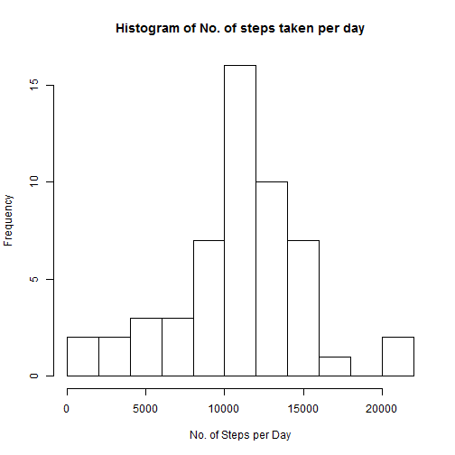
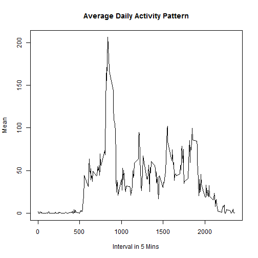
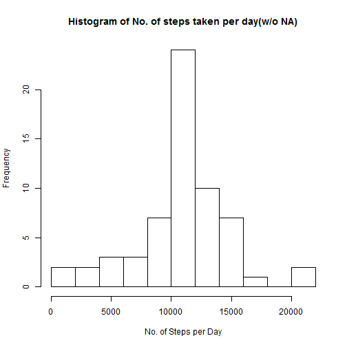
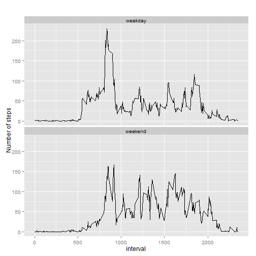

```r
library("dplyr")
library("sqldf")
library("ggplot2")
```
## Loading and preprocessing the data
Load the data and store it into data frome *activity*

```r
#Please change the working directory according to your storage location
setwd("G:/vimal/data science/JHU/RepResearch/RepData_PeerAssessment1/")
activity <- read.csv("activity.csv")
head(activity)
```

```
##   steps       date interval
## 1    NA 2012-10-01        0
## 2    NA 2012-10-01        5
## 3    NA 2012-10-01       10
## 4    NA 2012-10-01       15
## 5    NA 2012-10-01       20
## 6    NA 2012-10-01       25
```

##What is mean total number of steps taken per day?

*Make a histogram of the total number of steps taken each day*


```r
act_dt <- group_by(activity, date)
sum_act <- summarise(act_dt, tot = sum(steps))
sum_act$date <- as.Date(sum_act$date)
hist(sum_act$tot, breaks = 10, 
     main = 'Histogram of No. of steps taken per day',
     xlab = 'No. of Steps per Day')  
```

 

*Calculate and report the mean and median of the total number of steps taken per day*


```r
act_mean <- as.integer(mean(sum_act$tot, na.rm = T))
act_median<- median(sum_act$tot, na.rm = T)
```
**The mean steps taken per day is 10766 and the median is 10765.**


##What is the average daily activity pattern?

```r
act_dt <- group_by(activity, interval)
avt_act <- summarise(act_dt, mn = mean(steps, na.rm = TRUE))
max_steps <- avt_act[which.max(avt_act$mn),]
plot(avt_act, type = 'l', 
     main = 'Average Daily Activity Pattern', 
     xlab = 'Interval in 5 Mins',
     ylab = 'Mean')
```

 

**The interval in which we have maximum steps is *835* and maximum number of steps are 206.**


## Imputing missing values
*Calculate and report the total number of missing values in the dataset*

```r
cnt <- table(is.na(activity$steps))
```

**The number of rows with missing value is 2304**

*We replace all NA's with the mean number of steps for that interval*

```r
activity_new <- activity
for(i in 1:nrow(activity_new)){
     if(is.na(activity_new$steps[i])){
          #replace all NA's with the mean of the same interval
          activity_new$steps[i] <- as.integer(round(avt_act$mn[avt_act$interval == activity_new$interval[i]]))
     }
}

act_dt <- group_by(activity_new, date)
sum_act <- summarise(act_dt, tot = sum(steps))
sum_act$date <- as.Date(sum_act$date)
act_mean <- as.integer(mean(sum_act$tot))
act_median<- median(sum_act$tot)
hist(sum_act$tot, breaks = 10, 
     main = 'Histogram of No. of steps taken per day(w/o NA)',
     xlab = 'No. of Steps per Day')
```

 

**The mean steps taken per day after replacing the NAs is 10765 and the median is 10762.**


## Are there differences in activity patterns between weekdays and weekends?
**creating a data frame using the above dataset with NAs and adding two colums**

1. weekday: saves the day of the week
2. iswd: is weekend? saves values 'weekday' or 'weekend'


```r
activity_new$date <- as.Date(activity_new$date)
activity_new$weekday <- weekdays(activity_new$date)
actn <- activity_new
sqldf()
query <- "select a.*, (CASE a.weekday WHEN 'Sunday' THEN 'weekend' 
                                      WHEN 'Saturday' THEN 'weekend' 
                                      ELSE 'weekday' END) as iswd 
                    from actn as a";
activity_new <- sqldf(query)
sqldf()

activity_new$iswd <- as.factor(activity_new$iswd)
act_dt <- group_by(activity_new, iswd, interval)
avt_act <- summarise(act_dt, mn = mean(steps, na.rm = T))
max_steps <- avt_act[which.max(avt_act$mn),]
```

*X-Y Plot for Weekend and Weekday Activity to compare both*

```r
qplot(x = interval, y = mn, data = avt_act,
      geom = c("line"), main = '' ,ylab = 'Number of steps')+
      facet_wrap ( ~ iswd, ncol = 1)
```

 

**From the above plot, we can infer that the average activty is less on Weekends compare to weekdays.**
